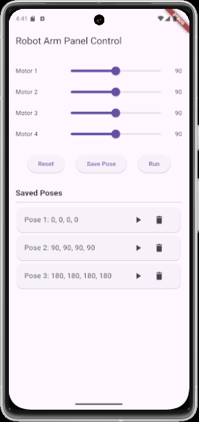
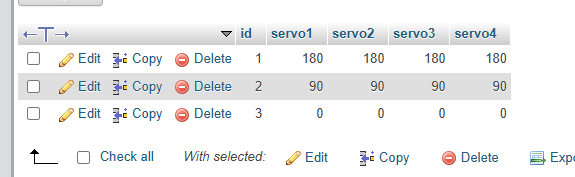

# Flutter Control Panel App  

## Project Title  
4-Motor Control Panel with Pose Management using Flutter and XAMPP

---

## Objective  
The objective of this project is to build a Flutter mobile application that allows users to control four motors and manage their positions (poses) through a user friendly interface. The app connects to a MySQL database using PHP scripts hosted on a XAMPP server to save, reset, run, load, and remove motor poses. This project demonstrates full-stack mobile integration using Flutter, PHP, and MySQL.

---

## Description  
The project consists of two main components:

### Flutter Interface  
A structured mobile interface built with Flutter that includes:

#### Motor Control Panel
- 4 sliders with numrical feild for Motor 1 to Motor 4 to set angles  
- Reset Button: Resets all motors to 90°  
- Save Pose Button: Saves the current motor positions to the database (Pose)  
- Run Button: Saves the current pose to the Run table for execution  

#### Pose Display Table
- A dynamic table listing all saved poses with columns:
  - Pose ID
  - Motor 1
  - Motor 2
  - Motor 3
  - Motor 4
  - Actions:  
    - Load – Loads the pose into the control panel  
    - Remove – Deletes the pose from the database  

---

### Database (MySQL via XAMPP/phpMyAdmin)  
Two tables manage the motor pose data:

#### Table: Pose
Stores all saved poses created by the user.

| Column     | Type    | Description               |
|------------|---------|---------------------------|
| id       | INT     | Auto-increment primary key|
| motor1   | FLOAT   | Angle of motor 1          |
| motor2   | FLOAT   | Angle of motor 2          |
| motor3   | FLOAT   | Angle of motor 3          |
| motor4   | FLOAT   | Angle of motor 4          |

#### Table: Run
Stores the pose to be executed.

| Column     | Type    | Description               |
|------------|---------|---------------------------|
| id       | INT     | Auto-increment primary key|
| motor1   | FLOAT   | Angle of motor 1          |
| motor2   | FLOAT   | Angle of motor 2          |
| motor3   | FLOAT   | Angle of motor 3          |
| motor4   | FLOAT   | Angle of motor 4          |
| status  | TINYINT | Default is 0 or it's 1     |

---

## Features  
- Real-time motor control interface  
- Save and run poses through button interactions  
- Reset motor angles to default with one click  
- Display saved poses from the database in a live table  
- Load any saved pose back into the interface  
- Delete unwanted poses easily  
- Clean and responsive design using Flutter widgets  
- Backend connected via XAMPP server and PHP  

---

## Tools and Platform  
- Platform: Android Studio (Flutter), XAMPP (Apache + MySQL)  
- Languages: Dart (Flutter), PHP  
- Database: MySQL (via phpMyAdmin)  
- Design Techniques:
  - Modular PHP files (save_pose.php, run_pose.php, get_poses.php, delete_pose.php, load_pose.php)
  - Mobile UI with structured layout using Column, ListView, DataTable
  - Localhost API calls via http://10.0.2.2/ for emulator access

---

## Project Screenshot  
Below are screenshots demonstrating the app and database interface:

- Flutter Interface  
  

- MySQL Table Pose  
  

- MySQL Table Run  
  

---
## Created By  
- Name: Aghadi Saleh Al-rebdi   
- Department: Computer Science  
- Year: 2025
