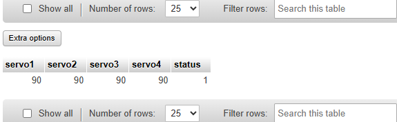

# Flutter Control Panel App  

## Project Title  
4-Motor Control Panel with Pose Management using Flutter and XAMPP

---

## Objective  
The objective of this project is to build a Flutter mobile application that allows users to control four motors and manage their positions (poses) through a user friendly interface. The app connects to a MySQL database using PHP scripts hosted on a XAMPP server to save, reset, run, load, and remove motor poses. This project demonstrates full-stack mobile integration using Flutter, PHP, and MySQL.

---

## Description  
The project consists of two main components:

### Flutter Interface  
A structured mobile interface built with Flutter that includes:

#### Motor Control Panel
- 4 sliders with numrical feild for Motor 1 to Motor 4 to set angles  
- Reset Button: Resets all motors to 90°  
- Save Pose Button: Saves the current motor positions to the database (Pose)  
- Run Button: Saves the current pose to the Run table for execution  

#### Pose Display Table
- A dynamic table listing all saved poses with columns:
  - Pose ID
  - Motor 1
  - Motor 2
  - Motor 3
  - Motor 4
  - Actions:  
    - Load – Loads the pose into the control panel  
    - Remove – Deletes the pose from the database  

---
### Database (MySQL via XAMPP/phpMyAdmin)

Two tables manage the motor pose data:

#### Table: `Pose`

This table stores all saved poses created by the user. It contains the following columns:

- **id**: An `INT` value, serves as the auto-increment primary key.
- **motor1**: A `FLOAT` representing the angle of motor 1.
- **motor2**: A `FLOAT` representing the angle of motor 2.
- **motor3**: A `FLOAT` representing the angle of motor 3.
- **motor4**: A `FLOAT` representing the angle of motor 4.

#### Table: `Run`

This table stores the pose that should be executed. It includes:

- **id**: An `INT` value, auto-increment primary key.
- **motor1**: A `FLOAT` for motor 1 angle.
- **motor2**: A `FLOAT` for motor 2 angle.
- **motor3**: A `FLOAT` for motor 3 angle.
- **motor4**: A `FLOAT` for motor 4 angle.
- **status**: A `TINYINT`, usually `0` or `1`, indicating whether this pose is selected to run.

---

## Features  
- Real-time motor control interface  
- Save and run poses through button interactions  
- Reset motor angles to default with one click  
- Display saved poses from the database in a live table  
- Load any saved pose back into the interface  
- Delete unwanted poses easily  
- Clean and responsive design using Flutter widgets  
- Backend connected via XAMPP server and PHP  

---

## Tools and Platform  
- Platform: Android Studio (Flutter), XAMPP (Apache + MySQL)  
- Languages: Dart (Flutter), PHP  
- Database: MySQL (via phpMyAdmin)  
- Design Techniques:
  - Modular PHP files (save_pose.php, run_pose.php, get_poses.php, delete_pose.php, load_pose.php)
  - Mobile UI with structured layout using Column, ListView, DataTable
  - Localhost API calls via http://10.0.2.2/ for emulator access
---

## Backend PHP Files

### `update_status.php`

```php
<?php
include 'db.php';

$servo1 = isset($_POST['servo1']) ? intval($_POST['servo1']) : 90;
$servo2 = isset($_POST['servo2']) ? intval($_POST['servo2']) : 90;
$servo3 = isset($_POST['servo3']) ? intval($_POST['servo3']) : 90;
$servo4 = isset($_POST['servo4']) ? intval($_POST['servo4']) : 90;

$conn->query("UPDATE run SET status = 0");

$stmt = $conn->prepare("INSERT INTO run (servo1, servo2, servo3, servo4, status) VALUES (?, ?, ?, ?, 1)");
$stmt->bind_param("iiii", $servo1, $servo2, $servo3, $servo4);

if ($stmt->execute()) {
    echo json_encode(['success' => true, 'message' => 'Run pose saved']);
} else {
    echo json_encode(['success' => false, 'error' => $conn->error]);
}

$stmt->close();
$conn->close();
?>


```

---

### `get_run_status.php`

```php

<?php
include 'db.php';

$result = $conn->query("SELECT * FROM Run WHERE status = 1");

if ($result && $row = $result->fetch_assoc()) {
    echo json_encode($row);
} else {
    echo json_encode(["message" => "No active run"]);
}

$conn->close();
?>
```

---

## Project Screenshots

Below are screenshots demonstrating the app and database interface:

### Flutter Interface  


### MySQL Table: `Pose`  


### MySQL Table: `Run`  


---
## Created By  
- Name: Aghadi Saleh Al-rebdi   
- Department: Computer Science  
- Year: 2025
